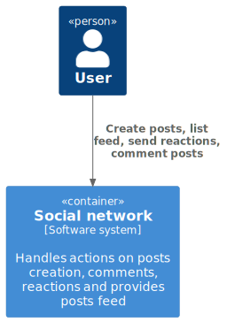
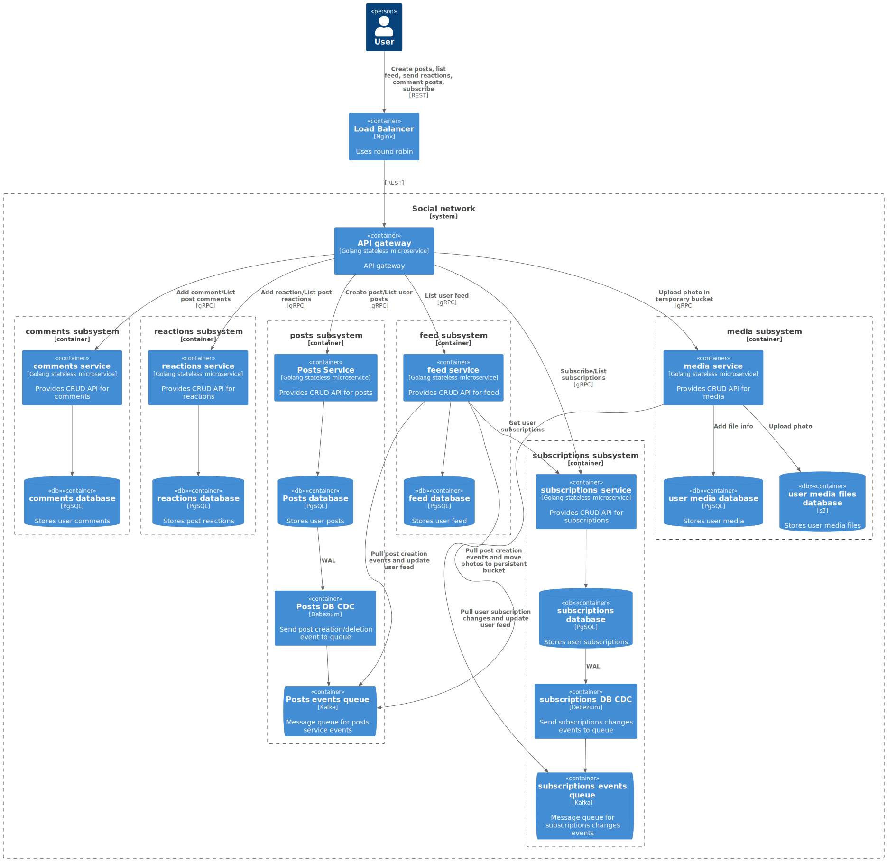

# System Design социальной сети для курса

System Design социальной сети для курса по [System Design](https://balun.courses/courses/system_design)

## Functional requirements:

* публикация постов из путешествий с фотографиями, небольшим описанием и привязкой к конкретному месту путешествия
* оценка и комментарии постов других путешественников
* подписка на других путешественников, чтобы следить за их активностью
* поиск популярных мест для путешествий и просмотр постов с этих мест
* просмотр ленты других путешественников

## Non-functional requirements:

* 10 000 000 DAU
* линейный рост числа пользователей (+ 10 000 000 DAU в год)
* availability 99, 95%
* Храним пользовательские данные всегда
* Сезонность:
  + Длительность - 3 месяца (июнь-авг)
  + Нагрузка на запись (увеличение количества публикаций, комментариев и реакций) - увеличивается в x2
  + Нагрузка на чтение - не изменяется

* Активность:
  + Подписки:
    - Подписка на других пользователей - в среднем 1 раз в месяц
    - Получить список подписок - в среднем 1 раз в месяц
  + Публикация постов:
    - в среднем 1 пост в месяц
    - в сезон - в среднем 2 постов в месяц
  + Просмотр ленты:
    - в среднем 10 запросов в день
  + Реакции:
    - в среднем 5 реaкций в день
  + Комментарии:
    - в среднем пользователь публикует 1 комментарий в день
    - в среднем пользователь просматривает комментарии под 5 постами

* Лимиты и ограничения:
  + Подписки:
    - Пользователь может иметь не более 1000 подписок
    - Пользователь может подписываться не более чем на 100 новых пользователей в день
  + Публикация постов:
    - Пользователь может оставить не более 20 постов в день
    - Описание поста - не более 250 символов
    - Не более 10 изображений на пост
    - Размер изображения до 3 МБ
  + Реакции:
    - Пользователь может оставить не более 1000 реакций в день
  + Комментарии:
    - Пользователь может оставить не более 100 комментариев в день
    - Размер комментария - до 500 символов

* Временные ограничения:
  + Подписки:
    - Подписаться - 1 секунда (0.9q)
    - Получить список подписок - 1 секунда (0.9q)
  + Публикация постов:
    - Загрузка одного изображения - 3 секунд (0.9q)
    - Создание поста - 2 секунды (0.9q)
    - Новые посты появляются в лентах подписчиков в течение 10 минут
  + Просмотр ленты:
    - Получить следующую страницу ленты - 3 секунды (0.9q)
  + Реакции:
    - Новые реакции обновляются на постах в течение 1 минуты
  + Комментарии:
    - Оставить комментарий - 2 секунды (0.9q)
    - Просмотр комментариев под постом - 1 секунда (0.9q)

## Basic calculations

* Connections = 10 000 000 * 0.1 = 1 000 000 соединений

### Подписки:

Предположения:
  + В среднем пользователь имеет 30 подписок
  + Подписка 16B
    - 2 id пользователя = 2 * 8B 

RPS:
  + Подписаться - в среднем 1 раз в месяц = dau * 1 / 30 / 86400 = 3.9 ~= 4 RPS
  + Список подписок - в среднем 1 раз в месяц = dau * 1 / 30 / 86400 = 3.9 ~= 4 RPS

Traffic:
  + WRITE 4 * 16 B ~= 0.1 KB/s
  + READ 4 * 16 * 30 B ~= 2 KB/s

### Посты и просмотр ленты

Предположения:
  + Средний пост содержит 2 фото размером 3 МБ 
  + Средний пост: ~0.5 KB
    - 200 символов unicode = 400B
    - id = 8B
    - user_id = 8B
    - timestamp = 8B
    - ссылки на связанные фото = несколько uuid - 2 * 16B = 32B
    - связанная локация 24B
      - координаты 16B
      - связаннаый идентификатор 8B

  + В среднем 10 запросов на просмотр ленты в день
  + За запрос получаем до 25 постов
  + Средний размер картинки в посте 1 МБ c учетом сжатия, оригинал картинки пользователь смотрит редко.
  + Размер ленты для пользователя в БД - 2.5 KB
    - id = 8 B
    - пусть хранится 300 последних постов = 8 * 300 = 2_400 B 

RPS:
  + WRITE (Публикация постов):
    - в среднем 1 пост в месяц = dau * 1 / 30 / 86400 = 3.9 ~= 4 RPS
      - загрузка фото - 2 * 4 = 8 RPS
    - в сезон - в среднем 2 постов в месяц = dau * 2 / 30 / 86400 = 7.7 ~= 8 RPS
      - загрузка фото - 2 * 8 = 16 RPS
  
  + READ (Получение ленты постов):
    - Получить страницу ленты = dau * 10 / 86400 = 1157 ~= 1200 RPS

Traffic:
  + WRITE:
    - Посты:
      - WRITE 4 RPS * 0.5 KB = 2 KB/s
      - WRITE 2 * 4 RPS * 0.5 KB = 4 KB/s (в сезон)
    - Файлы:
      - WRITE (фото) - 4 RPS (посты) * 2 (фото в каждом посте) * 3 MB = 24 MB/s
      - WRITE (фото) - 2 * 4 RPS (посты) * 2 (фото в каждом посте) * 3 MB = 48 MB/s (в сезон)
  + READ:
    - Лента с постами:
      - READ 1200 RPS * (средний размер поста) * (количество постов на странице) ~= 1200 RPS * 0.5 KB * 25 = 15 MB/s
    - Файлы:
      - READ 1200 RPS * (средний размер фото в посте ленты) * (количество постов на странице) * (количество фото в одном посте) = 1200 RPS * 1 MB * 25 * 2 = 60 GB/s

### Реакции

Предположения:
  + Реакция на пост - это:
    - id поста 8B
    - id реакции - 4B
    - счетчик 8B
    - список пользователей, поставивших реакцию:
      - user_id 8B
      - timestamp 8B
  + реакции запрашиваем после получения id поста
  + средний пост содержит 3 разные реакции
  + среднему пользователю не интересно пролистывать списки всех пользователей, оставивших реакцию, показываем по умолчанию - 3 последних пользователя.
  + чтобы поставить пост - передаем id поста + id реакции. считаем, что id пользователя получаем из заголовков авторизации
  + получаем реакции батчами по идентификаторам постов

RPS:
  + WRITE Поставить реакцию dau * 5 / 86400 = 578 ~= 600 RPS
  + WRITE Поставить реакцию dau * 2 * 2 / 86400 ~= 1200 RPS (в сезон)
  + READ Получить реакции к посту = (RPS чтение ленты с постами) = 1200

Traffic:
  + WRITE 600 RPS * (средний размер ) ~= 600 RPS * 16 B ~= 1 KB/s
  + WRITE 600 RPS * (средний размер ) ~= 600 RPS * 16 B ~= 2 KB/s (в сезон)
  + READ Получить реакции к посту = 1200 * 25 (постов в батче) * 3 (реакции на пост) * ( 20B + 3 (последних пользователя) * 16B  ) = 6.120 ~= 6 MB/s

### Комментарии

Предположения:
  + в среднем пользователь публикует 1 комментарий в день
  + в среднем пользователь просматривает комментарии под 5 постами
  + под средним постом - 5 комментов
  + средний коммент 100 символов + метадата = 250B
  
RPS:
  + WRITE Оставить комментарий = dau * 1 / 86400 ~= 120 RPS
  + WRITE Оставить комментарий = dau * 2 / 86400 ~= 240 RPS (в сезон)
  + Просмотр комментариев = dau * 5 / 86400 ~= 600 RPS

Traffic:
  + WRITE 120 RPS * (средний размер) ~= 120 RPS * 250 B = 30 KB/s
  + WRITE 600 RPS * (средний размер) ~= 600 RPS * 250 B = 60 KB/s (в сезон)
  + READ 600 RPS * (средний размер) * (количество комментариев) ~= 600 RPS * 250 B * 5 = 750 KB/s

### Итог:

Traffic:
  + Вне сезона:
    - WRITE = 0.1 KB/s + 2 KB/s + 1 KB/s + 30 KB/s ~= 35 KB/s
    - WRITE (файлы) = 24 MB/s
    - READ = 2 KB/s + 15 MB/s +  750 KB/s + 6 MB/s  ~= 22 MB/s
    - READ (файлы) = 60 GB/s

  + В сезон:
    - WRITE = 0.1 KB/s + 4 KB/s + 2 KB/s + 60 KB/s ~= 66 KB/s
    - WRITE (файлы) = 200 MB/s
    - READ = 2 KB/s + 15 MB/s +  750 KB/s + 6 MB/s  ~= 22 MB/s
    - READ (файлы) = 60 GB/s

  + System is read-intensive

## Модель БД и расчет хостов и дисков

[calculations](database/README.md)

## Design overview

Дизайн системы в нотации [C4 model](https://c4model.com/).

### System context diagram

### Container diagram

