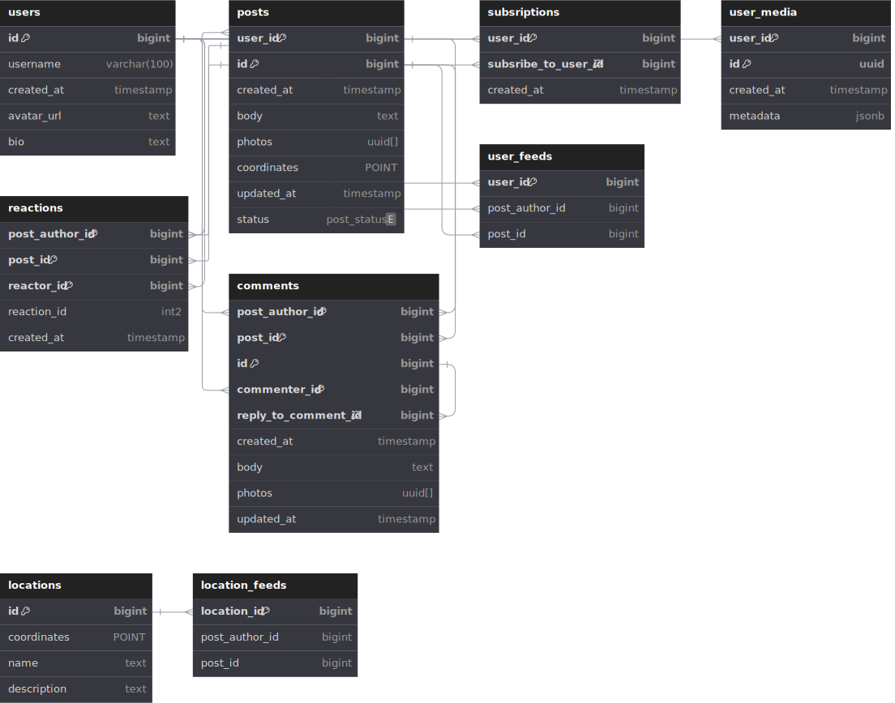

# Хранение данных

## Модель данных

[main](main.dbml) - общая модель, с учетом всех связей

### Базы данных:

> Для файлов используем S3-хранилище (Ceph)
>  
> Для прочих БД используем СУБД Postgres

* users
  + содержит данные профиля
  + шардируем по user_id
  
* posts
  + содержит информацию по постам каждого пользователя
  + шардируем по user_id
  + id поста - используем алгоритм snowflake/или аналог
    - id поста уникален для данного пользователя
    - id поста может быть использован для сортировки по времени создания

* subscriptions:
  + содержит информацию по подписками
  + шардируем по user_id

* user_media:
  + содержит информацию по файлам пользователя
  + шардируем по user_id
* user_media_files:
  + хранит файлы
 
* comments:
  + содержит конментарии по постам
  + шардируем по user_id автора поста

* reactions:
  + содержит реакции на пост
  + шардируем по user_id автора поста

* user_feeds:
  + содержит пользовательскую ленту постов 
  + шардируем по user_id пользователя
 
* locations_feeds:
  + содержит ленты постов, связанных с популярными локациями 
* locations:
  + содержит популярные локации

## Оценка дисков

### Предположительные данные в разрезе подсистем:

* posts:
  + row size: 0.5KB
  + WRITE IOPS: 8 (берем пиковое значение в сезон)
  + READ IOPS: 1200 (RPS)
  + Traffic: 30000 ops * 0.5KB = 15 MB/s
  + Количество записей за год: 4 RPS * 1.25 (учитываем сезонность) * 31536000 (1 год) = 157680000
  + Диск на 1 год: 157680000 * 0.5KB ~= 80GB

* user_media:
  + row size: 0.5KB
  + WRITE IOPS: 8 (берем пиковое значение в сезон)
  + READ IOPS: 1200 (RPS на ленту) * 25 (постов на странице) * 2 (фото в среднем посте) = 60000
  + Traffic: 60000 ops * 0.5KB = 30 MB/s
  + Количество записей за год: 2 (фото в среднем посте) * 4 RPS * 1.25 (учитываем сезонность) * 31536000 (1 год) = 315360000
  + Диск на 1 год: 315360000 * 0.5KB ~= 160GB
* user_media_files:
  + s3-storage
  + Для отображения в ленте используем изображение худшего качества. Храним и оригинал и фото для ленты
  + На хранение одного фото с учетом сжатия - 1MB
  + WRITE IOPS: 16 (берем пиковое значение в сезон)
  + READ IOPS: 1200 (RPS на ленту) * 25 (постов на странице) * 2 (фото в каждом посте) = 60000
  + Traffic: 48 MB/s (write в сезон) + 60 GB/s (read)
  + Количество файлов за год = 2 (фото в среднем посте) * 4 RPS * 1.25 (учитываем сезонность) * 31536000 (1 год) = 315360000
  + Диск на 1 год: 315360000 * 1MB ~= 315TB
  
* subscriptions:
  + row size: 24B
  + WRITE IOPS: 4
  + READ IOPS: 4
  + Traffic: 8 ops * 24B ~= 2 KB/s
  + Количество записей за год: 4 RPS * 31536000 (1 год) = 126144000
  + Диск на 1 год: 126144000 * 24B ~= 3GB

* comments: 
  + row size: 250B
  + WRITE IOPS: 240 (берем пиковое значение в сезон)
  + READ IOPS: 600
  + Traffic: 60 KB/s + 750 KB/s = 810 KB/s
  + Количество записей за год: 120 RPS * 1.25 (учитываем сезонность) * 31536000 (1 год) = 4730400000
  + Диск на 1 год: 4730400000 * 250B ~= 1.2TB

* reactions:
  + row size: 40B
  + WRITE IOPS: 1200 (берем пиковое значение в сезон)
  + READ IOPS: 1200
  + Traffic: 6 MB/s
  + Количество записей за год: 600 RPS * 1.25 (учитываем сезонность) * 31536000 (1 год) = 23652000000
  + Диск на 1 год: 23652000000 * 40B ~= 946GB ~=  1TB

* user_feeds:
  + row size: 32B
  + пусть хранится 300 последних постов
  + WRITE IOPS: 8 (берем пиковое значение создания постов в сезон)
  + READ IOPS: 1200
  + Traffic: 1200 * 32*300 ~= 12 MB/s
  + Диск: 32 * dau * 300 = 96GB ~= 100GB

|                  | Capacity | Traffic  | IOPs  |
|------------------|----------|----------|-------|
| posts            | 80 GB    | 15 MB/s  | 1200  |
| user_media       | 160 GB   | 30 MB/s  | 1200  |
| user_media_files | 315 TB   | 60 GB/s  | 60000 |
| subscriptions    | 3 GB     | 2 KB/s   | 8     |
| comments         | 1.2 TB   | 810 KB/s | 840   |
| reactions        | 1 TB     | 6 MB/s   | 2400  |
| user_feeds       | 100 GB   | 12 MB/s  | 1200  |

### Данные для расчета

**Используемые формулы:**

* **DfC** (Disks for capacity): `capacity / disk_capacity`
* **DfT** (Disks for throughput): `traffic_per_second / disk_throughput`
* **DfI** (Disks for iops): `iops / disk_iops`
* **Disks**: `max(ceil(Disks_for_capacity), ceil(Disks_for_throughput), ceil(Disks_for_iops))`

**Данные о дисках:**

|                                  | HDD        | SSD (SATA) | SSD (nVME) |
|----------------------------------|------------|------------|------------|
| Объем                            | до 32TB    | до 100TB   | до 30TB    |
| Пропускная способность           | 100 MB/sec | 500 MB/sec | 3 GB/sec   |
| Операции ввода-вывода в секунду  | 100        | 1 000      | 10 000     |
| Предполагаемая стоимость за диск | $100       | $300       | $500       |

### Подсчет количества дисков по capacity, throughput, iops

| subsystem                  | Capacity, GB | Traffic, MB/s | IOPs  | HDD, count | SSD (SATA), count | SSD (nVME), count | HDD, price $ | SSD (SATA), price $ | SSD (nVME), price $ |
|----------------------------|--------------|---------------|-------|------------|-------------------|-------------------|--------------|---------------------|---------------------|
| posts                      | 80           | 15            | 1200  | 1          | 1                 | 1                 | $100         | $300                | $500                |
| user_media                 | 160          | 30            | 1200  | 2          | 1                 | 1                 | $200         | $300                | $500                |
| user_media_files           | 315000       | 60000         | 60000 | 3150       | 630               | 105               | $315,000     | $189,000            | $52,500             |
| subscriptions              | 3            | 1             | 8     | 1          | 1                 | 1                 | $100         | $300                | $500                |
| comments                   | 1200         | 1             | 840   | 12         | 3                 | 1                 | $1,200       | $900                | $500                |
| reactions                  | 1000         | 6             | 2400  | 10         | 2                 | 1                 | $1,000       | $600                | $500                |
| user_feeds                 | 100          | 12            | 1200  | 1          | 1                 | 1                 | $100         | $300                | $500                |
|                            |              |               |       |            |                   |                   |              |                     |                     |
| TOTAL                      |              |               |       | 3177       | 639               | 111               | $317,700     | $191,700            | $55,500             |
| TOTAL * Replication Factor |              |               |       | 9531       | 1917              | 333               | $953,100     | $575,100            | $166,500            |

[disk_calculations](disk_calculations/disk_calculations.xlsx)

Итог:
  * для хранения фото (user_media_files) - используем SSD (nVME)
  * для comments, reactions используем SSD (SATA)
  * для остальных БД - можем использовать более дешевые HDD